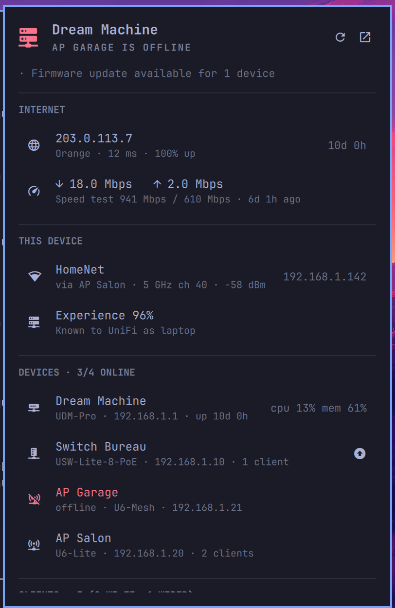

# UniFi for Omarchy

A bar widget for the [Omarchy](https://omarchy.org) shell that answers "is my
UniFi network OK?" at a glance, with a keyboard-driven panel for details.

<p align="center">
  
</p>
<p align="center"><sub>Demo data (<code>"demo": true</code>)</sub></p>

- **Bar icon** turns urgent when something is wrong, dims when the console is
  unreachable, and shows a key when setup is needed. Optionally shows a short
  value beside it: client count, devices online, or WAN latency.
- **Internet**: WAN status, public IP, ISP, latency, availability, live
  throughput, last speed test, and a backup WAN if you have one.
- **This device**: the Wi-Fi you are on, the access point serving you, band,
  channel, signal, and UniFi's experience score.
- **Devices**: gateway, switches, and access points with state, clients,
  uptime, CPU/memory, and pending firmware updates.
- **Clients**: who is connected, wired or Wi-Fi, searchable by name, IP, MAC,
  or SSID.
- **Notifications** when the network degrades and when it recovers.

## Requirements

- A UniFi console running UniFi Network 9 or later (UDM, UCG, UDR, Cloud Key,
  or a self-hosted Network application)
- `python3`, `secret-tool` (libsecret), and a running keyring such as
  gnome-keyring — all present on a stock Omarchy install
- `wl-copy` for the copy actions

## Install

```bash
omarchy plugin add https://github.com/vcanuel/omarchy-unifi.git --enable
```

Then click the key icon in the bar, or run the setup yourself:

```bash
~/.config/omarchy/plugins/vcanuel.unifi/bin/unifi setup
```

Setup asks for the console address (it defaults to your gateway), shows the
console's certificate fingerprint for you to confirm, and asks for an API key.
Create one in UniFi Network under **Settings → Control Plane → Integrations**.
A read-only key is enough.

## Usage

| Where | Input | Action |
|-------|-------|--------|
| Bar | left click | open the panel (or setup, if not configured) |
| Bar | middle click | refresh |
| Bar | right click | open the UniFi console as a web app |
| Panel | `j` / `k`, arrows | move the cursor |
| Panel | `enter` | copy the IP, or open the console for devices |
| Panel | `c` / `n` / `m` | copy IP / name / MAC of the selected row |
| Panel | `/` | filter clients |
| Panel | `r` | refresh |
| Panel | `o` | open the UniFi console |
| Panel | `s` | run setup again |
| Panel | `tab` | switch to the next bar panel |
| Panel | `esc` | close |

Shell IPC: `omarchy-shell vcanuel.unifi toggle|refresh|status|snapshot`.

## Settings

Settings live inline on the widget's entry in `~/.config/omarchy/shell.json`:

```json
{ "id": "vcanuel.unifi", "barLabel": "latency", "sections": ["self", "wan", "devices"] }
```

| Key | Default | Meaning |
|-----|---------|---------|
| `profile` | `"default"` | which console profile to use (see *Several consoles*) |
| `refreshIntervalSec` | `30` | polling interval, 10–3600 |
| `barLabel` | `"none"` | text beside the icon: `none`, `clients`, `devices`, `latency` |
| `sections` | all | panel sections and their order: `wan`, `self`, `devices`, `clients` |
| `maxClients` | `12` | clients listed before collapsing into "N more" |
| `notify` | `true` | notify when the network degrades or recovers |
| `deviceStats` | `true` | fetch per-device CPU, memory, and uptime (one request per device) |
| `legacyApi` | `true` | use the controller's internal endpoints for WAN and Wi-Fi details |
| `demo` | `false` | show a made-up network from the sample fixtures instead of your console |

### Several consoles

Run setup once per console with its own profile, then add one widget per
profile (the widget allows multiple instances):

```bash
bin/unifi --profile office setup
```

```json
{ "id": "vcanuel.unifi", "profile": "office" }
```

## Security

- The API key is stored in the desktop keyring, never in a file. Omarchy
  plugins share one QML scene, so the key is also kept out of QML entirely:
  the panel only ever sees the helper's JSON output.
- UniFi consoles use self-signed certificates. Instead of disabling
  verification, setup pins the certificate's SHA-256 fingerprint and every
  request refuses to send the key to anything else. A console behind a
  publicly trusted certificate uses normal CA verification.
- The plugin only reads. It makes no changes to your network.

## How it works

```
Panel.qml ── Service.qml ──runs──▶ bin/unifi status ──HTTPS + X-API-KEY──▶ console
   │                                     │
sections/*.qml ◀── snapshot JSON ◀───────┘   (+ ip / nmcli for this machine)
```

`bin/unifi` is a dependency-free Python helper. It queries the official
Network Integration API (sites, devices, statistics, clients) and, when
available, the controller's `stat/health` and `stat/sta` endpoints for WAN and
Wi-Fi details. It merges everything into one versioned snapshot. Optional
sources fail soft: if WAN health is unavailable, the Internet section hides
and the rest keeps working.

The helper is useful on its own:

```bash
bin/unifi status --pretty            # the snapshot the panel renders
bin/unifi status --demo --pretty     # the made-up network used for screenshots
bin/unifi raw integration/v1/sites   # any raw API path, for debugging
bin/unifi forget                     # remove the profile and its key
```

## Contributing

Adding a panel section means two small pieces:

1. If the data is new, add it to the snapshot in `lib/unifi/snapshot.py`
   (normalize it in `lib/unifi/normalize.py`) and cover it in
   `tests/test_snapshot.py`. Keep the change additive; bump `SCHEMA` only for
   breaking changes.
2. Create `sections/<Name>.qml` extending `components/Section.qml`, compute
   `rows` from `snapshot`, and add the name to `KNOWN_SECTIONS` in `Model.js`.
   Keyboard navigation, copy keys, and actions come from the base.

Run the tests with `./test`. Validate the manifest with
`omarchy plugin validate .`.

For development, link the checkout into the plugins directory:

```bash
ln -sfn "$PWD" ~/.config/omarchy/plugins/vcanuel.unifi
omarchy plugin enable vcanuel.unifi
```

The shell does not see edits made through the symlink, so reload QML changes
with `omarchy restart shell`. Helper changes (`bin/`, `lib/`) apply on the next
refresh. Set `"demo": true` on the widget to work on the UI without a console.

## License

MIT
